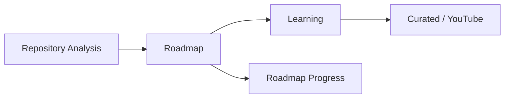
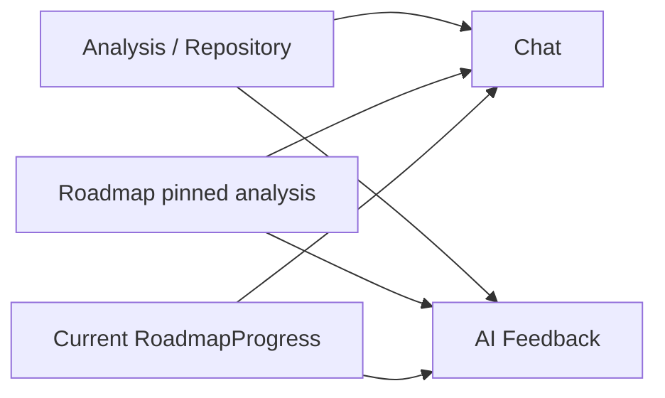

# 1. Tổng quan flow

Tài liệu này mô tả contract Backend sau khi đồng bộ source of truth. Các endpoint và field public cũ vẫn được giữ nguyên. Những selector/context field mới đều optional.





Source of truth:

- `AnalysisResult`: kết quả phân tích hiện tại.
- `RepoAnalysisSnapshot`: snapshot lịch sử thật, liên kết bằng `analysisResultId`.
- `Roadmap.roadmapSource`: analysis/snapshot được pin khi generate.
- `RoadmapProgress`: trạng thái task và progress authoritative.
- Legacy `AnalysisSnapshot`: chỉ fallback cho dữ liệu cũ khi không có current analysis; không phải nguồn mặc định.

# 2. API sequence cho Roadmap

FE gọi theo đúng thứ tự:

1. `POST /api/analysis/repositories/:repoId` để analyze repository.
2. `POST /api/roadmaps/generate` để tạo roadmap từ analysis mới nhất.
3. `GET /api/roadmaps/:roadmapId` để lấy detail.
4. `GET /api/roadmaps/:roadmapId/learning` để kiểm tra availability.
5. Nếu item có `learningStatus: "missing"`, gọi `POST .../items/:itemId/generate`.
6. Render content từ `data.learning`; có thể GET item lại để đọc cache.
7. `PATCH /api/roadmaps/:roadmapId/progress/items` để complete/uncomplete.
8. `GET /api/roadmaps/:roadmapId/progress` hoặc reload roadmap detail để đọc progress authoritative.

Roadmap generation không đồng nghĩa learning đã được generate. GET learning item không tự gọi LLM hoặc YouTube search.

# 3. Endpoint map

| Step | Method | Endpoint | Request | Response fields chính |
|---|---|---|---|---|
| Analyze | POST | `/api/analysis/repositories/:repoId` | path repository ID | `analysisId`, `snapshotId`, role/level/skills |
| Generate roadmap | POST | `/api/roadmaps/generate` | `targetRole`, source selector, role/level/language | `roadmapId`, `roadmapSource`, task arrays |
| Roadmap detail | GET | `/api/roadmaps/:roadmapId` | path roadmap ID | `data.roadmap` |
| Availability | GET | `/api/roadmaps/:roadmapId/learning` | path roadmap ID | `items[].itemId`, `learningStatus` |
| Learning generate | POST | `/api/roadmaps/:roadmapId/learning/items/:itemId/generate` | flags generate/resource | `data.learning` |
| Learning detail | GET | `/api/roadmaps/:roadmapId/learning/items/:itemId` | optional `includeResources` | `data.learning` |
| Update progress | PATCH | `/api/roadmaps/:roadmapId/progress/items` | `itemId`, `status`, optional percent | summary + progress items |
| Get progress | GET | `/api/roadmaps/:roadmapId/progress` | path roadmap ID | `progressSummary`, `items` |
| Create Chat session | POST | `/api/chat/sessions` | optional title | `session._id` |
| Send Chat message | POST | `/api/chat/sessions/:sessionId/messages` | message + optional context selectors | messages + optional safe `context` |
| Generate feedback | POST | `/api/ai-feedback/repositories/:repoId` | optional roadmap/analysis/snapshot selectors | existing feedback fields + provenance |
| Get feedback | GET | `/api/ai-feedback/results/:repoId` | optional `roadmapId` query | feedback + `isStale` |

Mọi endpoint trong flow đều yêu cầu Bearer token. Không gửi token trong log client.

# 4. ID mapping

| ID | Nguồn | FE sử dụng thế nào |
|---|---|---|
| `repositoryId` / `repoId` | Repository backend | Dùng ID backend trả về; analysis boundary còn hỗ trợ GitHub repo ID |
| `analysisId` | `AnalysisResult._id` | Chỉ dùng selector khi cần pin Chat/Feedback; không gọi là snapshot |
| `snapshotId` | `RepoAnalysisSnapshot._id` | Snapshot thật tương ứng analysis |
| `roadmapId` | `Roadmap._id` | Dùng cho detail, learning, progress, scoped Chat/Feedback |
| `itemId` | Stored task ID | Dùng nguyên giá trị backend trả về cho learning/progress |
| progress `itemId` | Cùng task `itemId` | Không phải ID mới |

FE không được tự tạo `itemId`, không dùng array index, `task.id`, hoặc Mongo subdocument `_id`. Backend lưu `itemId` một lần khi generate. Roadmap cũ chưa có ID dùng compatibility fallback; response vẫn trả field `itemId`.

# 5. Roadmap response fields

Generate response đặt roadmap trực tiếp tại `data`:

- `data.roadmapId`
- `data.roadmapSource`
- `data.mainRoadmap.phases[].tasks[]`
- `data.alternativeRoadmaps[].tasks[]`

Detail response đặt roadmap tại `data.roadmap`:

- `data.roadmap.roadmapId`
- `data.roadmap.roadmapSource`
- `data.roadmap.mainRoadmap.phases[].tasks[]`
- `data.roadmap.alternativeRoadmaps[].tasks[]`

Mỗi task có các field cần tích hợp:

- `itemId`
- `title`
- `description`
- `skillName`
- `canonicalSkillName`
- `category`
- `targetRole`
- `level`
- `week`
- `priority`
- `estimatedHours`

`roadmapSource` giữ field cũ và có thêm optional provenance:

- `analysisId` hoặc `analysisIds[]`
- `snapshotId` hoặc `snapshotIds[]`
- `repositoryId` hoặc `repositoryIds[]`
- `analyzedAt`
- `modelVersion`
- `evidenceVersion`

# 6. Learning availability

Endpoint:

```http
GET /api/roadmaps/:roadmapId/learning
```

Response item:

```json
{
  "itemId": "main-1-1-api-testing",
  "canonicalSkillName": "API Testing",
  "targetRole": "Backend Developer",
  "level": "intermediate",
  "learningStatus": "missing"
}
```

`learningStatus` có hai giá trị:

- `available`: cache `LearningContent` có đúng canonical skill, role, level và roadmap language.
- `missing`: chưa có content; FE cần gọi generate.

Map item bằng exact `itemId`, không map bằng tên skill vì một skill có thể xuất hiện ở nhiều task.

# 7. Learning generation

```http
POST /api/roadmaps/:roadmapId/learning/items/:itemId/generate
Content-Type: application/json
```

```json
{
  "forceRegenerate": false,
  "includeResources": true
}
```

- `201`: content mới được generate.
- `200`: content cache đã tồn tại và được dùng lại.
- `404`: roadmap/task không tồn tại, không thuộc user, hoặc GET content trước generate.
- Provider/parse error: FE hiển thị retry state; không tự đổi identity.

Khi `includeResources=true`, Backend chạy cache → curated → YouTube khi cần. Khi false, không search resource.

# 8. Learning content fields

Content luôn ở `data.learning` và giữ nguyên các field:

- `title`
- `overview`
- `whyLearn`
- `useCases`
- `howToApply`
- `examples`
- `checklist`
- `exercises`
- `commonMistakes`
- `nextSkills`
- `resources`

Không đọc các field chưa có trong contract như `summary`, `objectives`, `sections`, hoặc `quiz`.

# 8.1. Learning auto-generate flow for FE

Khi user click vào một task/bài học trong roadmap, FE nên mở learning content theo flow này:

1. Lấy đúng `roadmapId`.
2. Lấy đúng `itemId` từ task backend trả về.
3. Gọi API đọc content hoặc kiểm tra availability.
4. Nếu content chưa có thì tự gọi `POST generate`.
5. Render kết quả trực tiếp từ `data.learning`.

Quy tắc quan trọng cho `itemId`:

- Không tự tạo `itemId`.
- Không dùng array index.
- Không dùng `task.id`.
- Không dùng Mongo subdocument `_id` nếu task có.
- Không map bằng skill name vì một skill có thể xuất hiện ở nhiều task.

Có 2 cách implement hợp lệ.

## Option A: Availability-first

FE gọi trước:

```http
GET /api/roadmaps/:roadmapId/learning
```

Tìm item bằng exact `itemId`.

Nếu item có:

```json
{
  "learningStatus": "available"
}
```

thì gọi:

```http
GET /api/roadmaps/:roadmapId/learning/items/:itemId?includeResources=true
```

và render `data.learning`.

Nếu item có:

```json
{
  "learningStatus": "missing"
}
```

thì gọi:

```http
POST /api/roadmaps/:roadmapId/learning/items/:itemId/generate
Content-Type: application/json
```

```json
{
  "forceRegenerate": false,
  "includeResources": true
}
```

Sau đó render trực tiếp từ:

```js
response.data.data.learning
```

Không cần gọi `GET` lại ngay nếu `POST generate` đã trả đủ `data.learning`.

## Option B: GET-first with 404 fallback

FE gọi thẳng:

```http
GET /api/roadmaps/:roadmapId/learning/items/:itemId?includeResources=true
```

Nếu API trả `200`, render `data.learning`.

Nếu API trả `404` với ý nghĩa content chưa generate, gọi:

```http
POST /api/roadmaps/:roadmapId/learning/items/:itemId/generate
Content-Type: application/json
```

```json
{
  "forceRegenerate": false,
  "includeResources": true
}
```

Sau đó render trực tiếp:

```js
generateResponse.data.data.learning
```

Nếu `404` do roadmap/task không tồn tại hoặc không thuộc user, FE không retry generate vô hạn. Hãy reload roadmap detail và kiểm tra lại `itemId`.

## Recommended FE helper

```js
async function openRoadmapLearning(api, roadmapId, itemId) {
  try {
    const detailRes = await api.get(
      `/api/roadmaps/${roadmapId}/learning/items/${itemId}`,
      {
        params: { includeResources: true },
      }
    );

    return detailRes.data.data.learning;
  } catch (err) {
    const status = err.response?.status;
    const message = err.response?.data?.message || "";

    const shouldGenerate =
      status === 404 &&
      (
        message.includes("Learning content not found") ||
        message.includes("Please generate it first")
      );

    if (!shouldGenerate) {
      throw err;
    }

    const generateRes = await api.post(
      `/api/roadmaps/${roadmapId}/learning/items/${itemId}/generate`,
      {
        forceRegenerate: false,
        includeResources: true,
      }
    );

    return generateRes.data.data.learning;
  }
}
```

Nếu FE muốn dùng availability-first:

```js
async function openRoadmapLearningAvailabilityFirst(api, roadmapId, itemId) {
  const availabilityRes = await api.get(
    `/api/roadmaps/${roadmapId}/learning`
  );

  const item = availabilityRes.data.data.items.find(
    (x) => x.itemId === itemId
  );

  if (!item) {
    throw new Error("Learning item not found in roadmap availability response");
  }

  if (item.learningStatus === "available") {
    const detailRes = await api.get(
      `/api/roadmaps/${roadmapId}/learning/items/${itemId}`,
      {
        params: { includeResources: true },
      }
    );

    return detailRes.data.data.learning;
  }

  const generateRes = await api.post(
    `/api/roadmaps/${roadmapId}/learning/items/${itemId}/generate`,
    {
      forceRegenerate: false,
      includeResources: true,
    }
  );

  return generateRes.data.data.learning;
}
```

## Loading / retry UI

FE nên có các state:

- `idle`: chưa mở learning.
- `loading`: đang `GET` detail hoặc đang kiểm tra availability.
- `generating`: content chưa có, đang gọi `POST generate`.
- `ready`: đã có `data.learning`.
- `error`: lỗi thật.

Khi đang generate, có thể hiển thị:

```text
Đang tạo nội dung học cho kỹ năng này...
```

Nếu generate lỗi do provider/LLM/YouTube tạm lỗi, hiển thị nút Retry. Retry gọi lại `POST generate` với body:

```json
{
  "forceRegenerate": false,
  "includeResources": true
}
```

Không tự đổi `role`, `level`, `language`, `skillName`, hoặc `itemId`.

## Resource/video rendering

Sau khi có learning content, FE render video/resource từ:

```js
learning.resources
```

Mỗi resource có thể có:

```json
{
  "title": "...",
  "url": "...",
  "provider": "youtube",
  "thumbnailUrl": "...",
  "channelTitle": "...",
  "publishedAt": "...",
  "source": "...",
  "score": 0.93
}
```

Nếu `learning.resources.length === 0`, vẫn render learning content bình thường và chỉ hiển thị empty state:

```text
Chưa có video/tài nguyên phù hợp cho kỹ năng này.
```

Không coi `resources: []` là lỗi.

## Important rules

- Roadmap generate không tự generate learning content.
- `GET /learning` chỉ kiểm tra availability, không tạo content.
- `GET /learning/items/:itemId` chỉ đọc cache, không tự tạo content.
- `POST /learning/items/:itemId/generate` mới là API tạo content.
- FE phải dùng exact `itemId` từ backend.
- FE render từ `data.learning`, không đọc `summary`, `objectives`, `sections`, hoặc `quiz` vì các field đó không nằm trong contract hiện tại.
- `POST generate` trả `201` khi tạo mới, `200` khi dùng cache; FE xử lý cả hai như success.

Đoạn quan trọng nhất FE cần làm:

```text
Nếu GET learning item trả 404 "Learning content not found / Please generate it first"
-> gọi POST /api/roadmaps/:roadmapId/learning/items/:itemId/generate
-> render generateResponse.data.data.learning
```

# 9. YouTube resource fields

Resources nằm chính xác tại:

`data.learning.resources`

Mỗi resource public có:

- `title`
- `url`
- `provider`
- `thumbnailUrl`
- `channelTitle`
- `publishedAt`
- `source`
- `score`

`resources: []` là empty state hợp lệ. Backend ghi structured diagnostic nội bộ cho cache/curated/YouTube key/quota/provider/no-candidate/metadata/filter, nhưng không expose API key hoặc provider payload.

Learning content và resource đều dùng `roadmap.language`; không còn default resource language khác content language.

# 10. Progress flow

```http
PATCH /api/roadmaps/:roadmapId/progress/items
Content-Type: application/json
```

```json
{
  "itemId": "main-1-1-api-testing",
  "status": "completed"
}
```

Status hợp lệ: `not_started`, `in_progress`, `completed`.

Đọc lại:

- `data.progressSummary.totalItems`
- `data.progressSummary.completedItems`
- `data.progressSummary.inProgressItems`
- `data.progressSummary.overallProgress`
- `data.items[].status`
- `data.items[].completedAt`

`RoadmapProgress` là authoritative. Roadmap detail ưu tiên summary từ progress record để tránh hiển thị stale. Gọi completed lặp lại không đổi `completedAt`; uncomplete/reset sẽ clear. Overall vẫn dùng `completedItems / totalItems * 100`; partial percent không đóng góp overall cho đến khi status completed.

# 11. Chat flow

Request cũ vẫn hợp lệ:

```json
{
  "message": "Tôi nên học gì tiếp theo?"
}
```

Request mới có optional selectors:

```json
{
  "message": "Tiến độ roadmap hiện tại thế nào?",
  "repositoryId": "optional",
  "roadmapId": "optional",
  "analysisId": "optional",
  "snapshotId": "optional"
}
```

Priority:

1. Có `roadmapId`: dùng analysis/snapshot pinned trong roadmap và current `RoadmapProgress`.
2. Không có roadmap nhưng có `repositoryId`: dùng latest `AnalysisResult` của repository thuộc user.
3. Không có hai field trên nhưng có `analysisId`/`snapshotId`: validate ownership và dùng đúng record.
4. Không selector: latest current `AnalysisResult` của user.
5. Legacy snapshot chỉ fallback khi không có current analysis và có safe warning log.

Response giữ message fields cũ và thêm optional:

```json
{
  "context": {
    "repositoryId": "...",
    "analysisId": "...",
    "snapshotId": "...",
    "roadmapId": "...",
    "progressUpdatedAt": "2026-07-14T00:00:00.000Z",
    "analysisSource": "analysis_result"
  }
}
```

# 12. AI Feedback flow

Backward-compatible request:

```http
POST /api/ai-feedback/repositories/:repoId
```

Roadmap-scoped request:

```json
{
  "roadmapId": "665f1f000000000000000001"
}
```

Optional fields: `roadmapId`, `analysisId`, `snapshotId`. Với roadmap scope, Backend dùng pinned analysis/snapshot và current progress, gồm completed/in-progress/pending tasks và recently completed task. Không có roadmap thì giữ behavior latest repository analysis.

Response giữ toàn bộ feedback fields cũ, đồng thời có optional:

- `analysisId`
- `snapshotId`
- legacy alias `analysisSnapshotId` (nay chỉ chứa snapshot thật hoặc null)
- `roadmapId`
- `progressUpdatedAt`
- `context`
- `isStale`

GET hỗ trợ:

```http
GET /api/ai-feedback/results/:repoId?roadmapId=...
```

`isStale=true` khi current analysis khác provenance hoặc progress mới hơn feedback. FE nên đề nghị user regenerate bằng POST.

# 13. Backward compatibility

- Không endpoint nào bị đổi.
- Không field public cũ nào bị xóa/đổi tên.
- Request Chat chỉ có `message` vẫn hoạt động.
- Feedback POST không body vẫn dùng latest repository analysis.
- `analysisSnapshotId` vẫn tồn tại nhưng không còn bị gán nhầm `AnalysisResult._id`.
- Roadmap cũ thiếu snapshot được resolve từ `analysisId` khi read.
- Roadmap cũ thiếu stored `itemId` dùng fallback deterministic; progress migration theo item ID hoặc canonical skill + title signature.
- FE cũ không bắt buộc sửa ngay. FE nên cập nhật generate-on-missing, stored `itemId`, roadmap-scoped Chat/Feedback và stale UI.

# 14. Error handling

| Error/Status | Ý nghĩa | FE nên làm gì |
|---|---|---|
| Learning GET 404 | Content chưa generate hoặc item không tồn tại | Kiểm tra availability; nếu missing thì POST generate |
| Invalid/wrong `itemId` 400/404 | FE tự tạo hoặc dùng ID khác | Reload roadmap và dùng exact task `itemId` |
| `resources: []` | Không có curated/video hợp lệ hoặc provider unavailable | Vẫn render content; hiển thị “video chưa khả dụng” |
| Generate provider error 5xx | LLM/YouTube/provider tạm unavailable | Cho retry, không đổi role/level/language |
| Feedback `isStale=true` | Analysis/progress mới hơn feedback đã lưu | Gọi POST generate feedback lại |
| Ownership 404 | ID không tồn tại hoặc không thuộc user | Không retry với ID đó; quay lại list owned data |
| Validation 400 | Selector/body sai type hoặc thiếu field | Sửa request theo contract |
| 401 | Token thiếu/hết hạn/revoked | Re-authenticate |

# GitHub disconnect / reconnect flow

## 1. Kiểm tra trạng thái connect

```http
GET /api/github/account
Authorization: Bearer <app_jwt>
```

Nếu `connected=false`:

- Hiện nút: Connect GitHub.

Nếu `connected=true`:

- Hiện avatar/username.
- Hiện nút:
  - Disconnect GitHub.
  - Connect another GitHub account.

Backend không bao giờ trả `accessToken` trong response này.

## 2. Disconnect GitHub

FE gọi:

```http
DELETE /api/github/account
Authorization: Bearer <app_jwt>
```

Sau success:

- Set local UI `connected=false`.
- Reload repository list nếu cần.
- Không xóa roadmap/analysis cũ khỏi UI nếu app vẫn cho xem lịch sử.

Disconnect chỉ unlink GitHub khỏi app và xóa local token phía backend. Backend không xóa `User`, `Repository`, `AnalysisResult`, `RepoAnalysisSnapshot`, `Roadmap`, `RoadmapProgress`, `LearningContent`, `LearningResource`, `Chat`, hoặc AI Feedback cũ.

## 3. UI tốt hơn sau khi disconnect

Sau khi `DELETE /api/github/account` success, FE hiển thị:

```text
Disconnect GitHub
-> success
-> hiện 2 nút:

[Connect lại GitHub]
[Đăng xuất GitHub.com để dùng tài khoản khác]
```

Nút `[Connect lại GitHub]`:

- Redirect tới `GET /api/github/connect` hoặc endpoint cũ `GET /api/github/oauth`.

Nút `[Đăng xuất GitHub.com để dùng tài khoản khác]`:

- Mở tab mới: `https://github.com/logout`.
- Sau đó hiển thị hướng dẫn: "Sau khi đăng xuất GitHub.com xong, quay lại app và bấm Connect lại GitHub."

Không tự động gọi connect ngay sau khi mở GitHub logout, vì user có thể chưa logout xong.

## 4. Connect account khác

Recommended flow:

1. `DELETE /api/github/account`.
2. User chọn "Đăng xuất GitHub.com để dùng tài khoản khác".
3. FE mở `https://github.com/logout` ở tab mới.
4. User logout GitHub.com.
5. User quay lại app.
6. User bấm "Connect lại GitHub".
7. FE redirect `GET /api/github/connect` hoặc `GET /api/github/connect?forceAccountSelection=true`.

`forceAccountSelection=true` là hint cho reconnect UX. Backend vẫn không thể xóa cookie/session của github.com.

## 5. Giải thích rõ cho FE/user

- Disconnect trong app chỉ unlink GitHub khỏi hệ thống của mình.
- Disconnect không tự đăng xuất khỏi GitHub.com.
- Backend không thể xóa cookie/session của github.com.
- Nếu GitHub vẫn tự dùng account cũ, user cần logout GitHub.com hoặc dùng incognito/private window.
- Sau khi connect account khác, FE nên reload GitHub account status và repository list.
- Nếu repo cũ không accessible bằng account mới, FE nên hiển thị repo đó cần connect lại đúng account hoặc chọn repo khác.

## 6. Example responses

GET account khi chưa connect:

```json
{
  "success": true,
  "message": "GitHub account fetched successfully",
  "data": {
    "connected": false,
    "account": null
  },
  "errorCode": null
}
```

GET account khi đã connect:

```json
{
  "success": true,
  "message": "GitHub account fetched successfully",
  "data": {
    "connected": true,
    "account": {
      "githubUserId": "123456",
      "username": "octocat",
      "displayName": "The Octocat",
      "avatarUrl": "https://avatars.githubusercontent.com/u/123456?v=4",
      "email": "octocat@example.com",
      "connectedAt": "2026-07-14T00:00:00.000Z",
      "updatedAt": "2026-07-14T00:00:00.000Z"
    }
  },
  "errorCode": null
}
```

DELETE account success:

```json
{
  "success": true,
  "message": "GitHub account disconnected successfully",
  "data": {
    "connected": false,
    "githubLogoutUrl": "https://github.com/logout",
    "note": "Disconnected from this app. To connect a different GitHub account, log out from GitHub.com or use an incognito window before reconnecting."
  },
  "errorCode": null
}
```

## 7. Error handling

| Case | FE nên làm |
|---|---|
| 401 | Yêu cầu login lại app |
| connected=false | Hiện Connect GitHub |
| disconnect success | Hiện 2 nút reconnect/logout GitHub |
| GitHub vẫn tự chọn account cũ | Hướng dẫn logout GitHub.com/incognito |
| OAuth cancel/error | Hiện retry connect |
| repo cũ không accessible bằng account mới | Hiển thị repo cần connect lại đúng account hoặc chọn repo khác |

# 15. Example requests and responses

## Roadmap generate

```json
{
  "targetRole": "Backend Developer",
  "roleId": "backend",
  "sourceMode": "single_repo",
  "repoId": "665f1f000000000000000010",
  "language": "vi",
  "forceRegenerate": false
}
```

```json
{
  "success": true,
  "data": {
    "roadmapId": "665f1f000000000000000020",
    "roadmapSource": {
      "analysisId": "665f1f000000000000000030",
      "snapshotId": "665f1f000000000000000031",
      "repositoryId": "665f1f000000000000000010"
    }
  }
}
```

## Learning generate

```json
{
  "forceRegenerate": false,
  "includeResources": true
}
```

```json
{
  "success": true,
  "data": {
    "itemId": "main-1-1-api-testing",
    "learning": {
      "title": "API Testing",
      "overview": "...",
      "language": "vi",
      "resources": []
    }
  }
}
```

## Progress update

```json
{
  "itemId": "main-1-1-api-testing",
  "status": "completed"
}
```

## Roadmap-scoped Chat

```json
{
  "message": "Tôi đã hoàn thành những task nào?",
  "roadmapId": "665f1f000000000000000020"
}
```

## Feedback request

```json
{
  "roadmapId": "665f1f000000000000000020"
}
```

# 16. FE implementation checklist

- [ ] Lưu `analysisId` và real `snapshotId` từ analysis response.
- [ ] Generate roadmap với đúng `sourceMode`/repo selection.
- [ ] Dùng `roadmapSource` để debug provenance, không tự suy ra snapshot.
- [ ] Dùng exact stored `itemId` cho learning và progress.
- [ ] Gọi availability trước; generate khi `learningStatus=missing`.
- [ ] Render content từ `data.learning`.
- [ ] Render video từ `data.learning.resources[].url`.
- [ ] Chấp nhận `resources: []` mà không làm mất learning content.
- [ ] Complete bằng PATCH và reload `progressSummary`.
- [ ] Gửi `repositoryId` cho repository-scoped Chat.
- [ ] Gửi `roadmapId` cho Chat/Feedback cần progress/pinned analysis.
- [ ] Dùng optional `context` để debug mismatch.
- [ ] Nếu feedback `isStale=true`, hiển thị CTA regenerate.
- [ ] Không log Bearer token, source code, patch hoặc provider payload.
