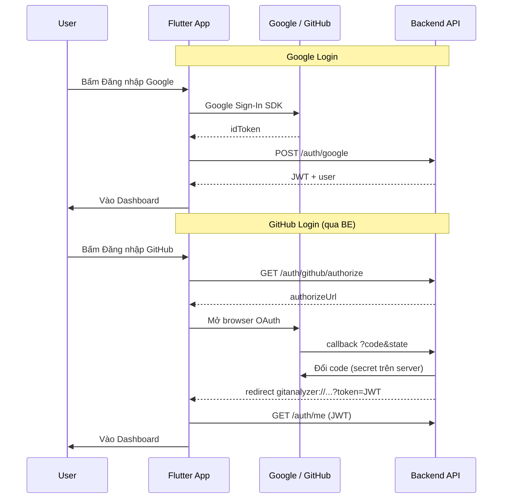

# Đăng nhập Google & GitHub trên Mobile — Giải thích & việc cần làm

Tài liệu này giải thích **tại sao** phải cấu hình social login cho Flutter, **khác gì** so với Web, và **bạn cần làm gì** trên BE / Google Cloud / GitHub.

---

## 1. Bối cảnh: Web, BE và Mobile không giống nhau

| Thành phần | Trạng thái trước khi làm mobile |
|------------|----------------------------------|
| **BE** | Đã có `POST /api/auth/google` và `POST /api/auth/github` |
| **Web** | `POST /api/auth/google` với Google Identity Services (`idToken`) |
| **Flutter** | Google Sign-In SDK → `idToken` → `POST /api/auth/google` (giống Web) |

**Kết luận:** BE + Web + Mobile đều gọi `POST /api/auth/google { idToken }`. Mobile dùng SDK native thay vì Google Identity Services trên browser.

---

## 2. Tại sao Google và GitHub cần cách làm khác nhau?

### Google Login

```
[App] → Google Sign-In SDK → idToken
[App] → POST /api/auth/google { idToken }
[BE]  → xác thực token với Google → tạo JWT app → trả về
```

- Mobile dùng SDK `google_sign_in`, **không** mở browser như Web.
- BE chỉ cần `idToken` — không cần redirect URL phức tạp.
- **Vì sao cần `GOOGLE_CLIENT_ID` trong app?**  
  SDK cần biết OAuth client để lấy `idToken`. ID này phải **trùng** `GOOGLE_CLIENT_ID` trên BE (đã có trong `.env.example`).
- **Vì sao cần SHA-1 trên Android?**  
  Google chỉ chấp nhận app Android nếu package name + SHA-1 fingerprint đã đăng ký trong Google Cloud Console.

### GitHub Login

GitHub **không có SDK đăng nhập** giống Google trên mobile. Luồng chuẩn:

```
[App] → mở browser → user đồng ý trên github.com
→ redirect về app (deep link gitanalyzer://...)
→ đổi `code` lấy access token
→ POST /api/auth/github { accessToken }
```

**Vấn đề bảo mật:** Đổi `code` → `access_token` cần **`GITHUB_CLIENT_SECRET`**.  
**Không được** nhúng secret vào APK (ai cũng decompile được).

**Giải pháp đã chọn:** OAuth qua **BE làm trung gian**:

```
[App] → GET /api/auth/github/authorize?redirectUrl=gitanalyzer://github/auth/callback
[BE]  → trả authorizeUrl (callback về server BE, không phải app)
[User] → đăng nhập GitHub
[GitHub] → redirect về BE /api/github/oauth/callback?code&state
[BE]  → đổi code (dùng secret trên server) → đăng nhập user → redirect app:
        gitanalyzer://github/auth/callback?token=<JWT>&success=true
[App] → lưu JWT → vào app
```

**Vì sao phải sửa BE?**  
Endpoint cũ `POST /auth/github` chỉ nhận `accessToken` — app không nên tự đổi code. Cần thêm `GET /auth/github/authorize` và nhánh `flow: login` trong OAuth callback.

---

## 3. Những gì đã làm trong code

### Backend (`BE/`)

| Thay đổi | Lý do |
|----------|--------|
| `GithubOAuthState`: thêm `flow: connect \| login`, `userId` không bắt buộc khi login | Phân biệt **kết nối repo** (đã login) vs **đăng nhập bằng GitHub** |
| `GET /api/auth/github/authorize` | App lấy URL OAuth mà không cần secret |
| Callback OAuth: nếu `flow === login` → gọi `loginWithGithub` → redirect app kèm JWT | Hoàn tất login trên server, app chỉ nhận token |
| `MOBILE_AUTH_REDIRECT_URL` trong `.env.example` | BE biết redirect về deep link nào sau khi login |
| `github.controller`: lỗi login redirect về `gitanalyzer://...?error=` | User thấy lỗi trên app, không bị đẩy sang trang web |

### Flutter (`flutter_app/`)

| Thay đổi | Lý do |
|----------|--------|
| `SocialAuthService`: Google → idToken; GitHub → BE OAuth (mặc định) | Khớp kiến trúc bảo mật |
| `AuthRepository.completeSocialLoginWithToken` | Lưu JWT từ deep link GitHub |
| `SocialLoginPanel` widget | Khớp Web `SocialLoginPanel.tsx` — nút Google/GitHub + thông báo lỗi |
| `AndroidManifest`: `gitanalyzer://github/auth/callback` | Android nhận deep link |
| `Info.plist`: scheme `gitanalyzer` + Google URL scheme | iOS nhận deep link + Google Sign-In |
| `GitHubAuthCallbackScreen` | Xử lý khi app mở lại từ deep link (cold start) |

### Khác với Web

- Web: Google Identity Services (browser) → `credential` → `POST /auth/google`
- Mobile: `google_sign_in` SDK → `idToken` → `POST /auth/google` (cùng API BE)

---

## 4. Việc BẠN cần làm (không tự chạy được chỉ bằng code)

### 4.1. Deploy BE mới lên Render

Production hiện tại **chưa có** `GET /auth/github/authorize` cho đến khi bạn push & deploy nhánh `BE`.

Sau deploy, kiểm tra:

```http
GET https://career-roadmap-api-zs7y.onrender.com/api/auth/github/authorize?redirectUrl=gitanalyzer://github/auth/callback
```

Phải trả `authorizeUrl`, không phải 404.

### 4.2. Cấu hình biến môi trường trên BE (Render)

```env
GOOGLE_CLIENT_ID=970437677508-k1jc855q10hnl3sktcop9job68hgkd0r.apps.googleusercontent.com

GITHUB_CLIENT_ID=<id-oauth-app-github>
GITHUB_CLIENT_SECRET=<secret-oauth-app-github>
GITHUB_CALLBACK_URL=https://career-roadmap-api-zs7y.onrender.com/api/github/oauth/callback

MOBILE_AUTH_REDIRECT_URL=gitanalyzer://github/auth/callback
MOBILE_REDIRECT_URL=gitanalyzer://github/connect
```

| Biến | Vì sao cần |
|------|------------|
| `GITHUB_CLIENT_*` | BE đổi `code` GitHub và gọi API GitHub |
| `GITHUB_CALLBACK_URL` | URL đăng ký trên GitHub OAuth App — **phải trùng** URL trong GitHub settings |
| `MOBILE_AUTH_REDIRECT_URL` | Sau login GitHub, BE redirect JWT về app |
| `GOOGLE_CLIENT_ID` | BE verify `aud` của idToken từ mobile |

### 4.3. GitHub OAuth App

Trên [GitHub → Settings → Developer settings → OAuth Apps](https://github.com/settings/developers):

- **Authorization callback URL** = `GITHUB_CALLBACK_URL` (URL **của BE**, không phải `gitanalyzer://...`)
- Deep link `gitanalyzer://github/auth/callback` chỉ dùng **sau** BE xử lý xong

> Một OAuth App GitHub chỉ có **một** callback URL → dùng URL server BE. App mobile không đăng ký trực tiếp lên GitHub.

### 4.4. Google Cloud Console (Android)

1. Vào [Google Cloud Console](https://console.cloud.google.com) → APIs & Services → Credentials  
2. Tạo **OAuth 2.0 Client ID** loại **Android**  
   - Package: `com.gitanalyzer.app.gitanalyzer_flutter`  
   - SHA-1: lấy bằng `cd android && gradlew signingReport`  
3. Giữ **Web client ID** (đã dùng làm `serverClientId` / `GOOGLE_CLIENT_ID`) — BE và app dùng chung ID này

**Nếu thiếu SHA-1:** Google Sign-In mở được nhưng `idToken` = null → login fail.

### 4.5. Chạy Flutter

```powershell
cd D:\PRM\Mobile_Project\flutter_app

# Production API (mặc định)
flutter run -d emulator-5554

# BE local
flutter run -d emulator-5554 --dart-define=API_BASE_URL=http://10.0.2.2:5000/api
```

Tùy chọn (ít dùng — chỉ khi tự đổi code GitHub trên app, **không khuyến nghị**):

```powershell
--dart-define=USE_BACKEND_GITHUB_LOGIN=false
--dart-define=GITHUB_CLIENT_ID=...
--dart-define=GITHUB_CLIENT_SECRET=...
```

---

## 5. Hai luồng GitHub — đừng nhầm

| Luồng | Khi nào | API |
|-------|---------|-----|
| **Đăng nhập bằng GitHub** | Chưa có tài khoản / login bằng GitHub | `GET /auth/github/authorize` → JWT |
| **Kết nối GitHub** (sau khi đã login email) | Đồng bộ repo | `GET /github/oauth` (cần JWT) → link account |

Login screen dùng luồng 1.  
Màn **Kết nối GitHub** / Settings dùng luồng 2.

---

## 6. Sơ đồ tổng thể



---

## 7. Checklist nhanh

- [ ] Deploy BE có `/auth/github/authorize`
- [ ] Render env: `GITHUB_*`, `MOOGLE_AUTH_REDIRECT_URL`, `GOOGLE_CLIENT_ID`
- [ ] GitHub OAuth App callback = URL BE
- [ ] Google Cloud: Android client + SHA-1
- [ ] Test Login Google trên emulator/device thật
- [ ] Test Login GitHub trên emulator/device thật

---

## 8. Lỗi thường gặp

| Triệu chứng | Nguyên nhân |
|-------------|-------------|
| GitHub: "BE không trả về authorizeUrl" | BE chưa deploy / thiếu `GITHUB_CLIENT_ID` |
| GitHub: redirect web thay vì app | Thiếu `MOBILE_AUTH_REDIRECT_URL` hoặc state `flow` không phải `login` |
| Google: "Không lấy được idToken" | SHA-1 chưa thêm Google Console hoặc sai `GOOGLE_CLIENT_ID` |
| Google: 401 Invalid Google token | `GOOGLE_CLIENT_ID` app ≠ BE |
| Web vẫn báo "chưa hỗ trợ" | Cập nhật Web mới nhất — đã có Google login |

---

*Tài liệu liên quan: `lib/core/auth/social_auth_service.dart`, `lib/core/config/app_config.dart`, `BE/src/services/github/github.oauth.service.js`*
